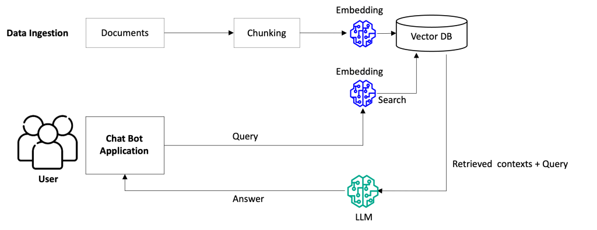

# tax-ai — 소득세 AI 상담 챗봇

소득세법 원문 기반 AI 세금 상담 챗봇. 임의 해석 없이 법령 조항을 직접 검색·인용해 근거 있는 답변을 제공하며, 사업소득·프리랜서는 세액까지 계산합니다.

## 주요 기능

| 기능               | 설명                                                                               |
| ------------------ | ---------------------------------------------------------------------------------- |
| 대화형 세금 상담   | 자연어로 소득·비용 정보를 입력하면 단계적으로 세액 산출                            |
| 세법 조항 검색     | 소득세법·시행령·시행규칙 원문을 의미 기반(vector) 검색 및 조항 번호 직접 조회      |
| 세액 계산 범위     | 법령 질의응답은 소득세법 전반 가능, 세액 계산은 사업소득·프리랜서(인적용역)만 지원 |
| 결정론적 세액 계산 | LLM이 아닌 서버 함수(`tax_calculator`)로 계산, 내부 검증 후 결과 반환              |
| 경비율 자동 선택   | 업종코드와 수입 금액에 따라 단순/기준경비율 자동 선택                              |
| 대화 이력 저장     | 모든 메시지 AES-256-GCM 암호화 후 DB 저장, 이전 상담 이어보기 가능                 |

## RAG 파이프라인



### Chunking 전략

기본 단위는 **조(Article)**. 법령 조문 하나가 독립적인 법적 의미를 가지므로 조 단위를 청킹의 기준으로 삼습니다.

```
조(Article) 토큰 추정
    │
    ├── ≤ 900 tokens ──→ 단일 청크
    │
    └── > 900 tokens ──→ 항(①②③...) 단위 분할
                          │
                          ├── 각 청크 = header + 이전 항 + 현재 항  (overlap)
                          │
                          └── > 1200 tokens ──→ Fixed-size chunking (줄 단위 누적, 최후 수단)
```

### Retrieval 파이프라인

```
사용자 쿼리
    │
    ▼
[쿼리 임베딩]  Voyage AI voyage-3.5 → 1024-dim 벡터
    │
    ▼
[하이브리드 검색]  PostgreSQL + pgvector (단일 SQL)
    ├── Vector : cosine similarity × 0.8
    └── BM25   : ts_rank_cd 정규화 × 0.2
    │
    │  필터 조건
    ├── vector similarity > 0.3  OR  BM25 키워드 매칭
    └── hybrid score > 0.05
    │
    ▼
[상위 5개 반환]  hybrid score DESC → LLM 컨텍스트로 전달
```

**가중치 근거** — 세법 조항은 공통 용어 반복이 많아 BM25 변별력이 낮고,
LLM 용어 변환이 불완전할 때도 Vector가 의미로 커버하므로
Vector 80% 주력, BM25 20% 보조로 설정.

## 대화 흐름

```
유저 (브라우저)
  │  useChat hook (Vercel AI SDK)
  ▼
app/chat/[sessionId]
  │  POST /api/chat
  ▼
Route Handler: streamText()
  ├── tool: vector_search      ──▶ pgvector (세법 검색)
  ├── tool: law_article_lookup ──▶ 특정 조문 조회
  └── tool: tax_calculator     ──▶ 결정론적 계산 함수
  │         │
  │         └── verifyResult() ──▶ 수식 검증 (실패 시 재시도)
  ▼
스트리밍 응답 ──▶ 유저 화면에 실시간 표시

(비동기) 메시지 + tool 이력 DB 암호화 저장
```

## Observability (LLM 모니터링)

Langfuse로 모든 요청의 실행 이력을 추적합니다.

**트레이싱** — 요청마다 trace 생성, tool 호출 순서·입력·출력·토큰 사용량·latency 기록

**자동 스코어링** — 응답 완료 시 아래 항목을 자동 기록:

| 스코어                   | 설명                                                                     |
| ------------------------ | ------------------------------------------------------------------------ |
| `intent`                 | 호출 tool 기준 요청 분류 (계산 / 조문조회 / 상담 / 도구없음)             |
| `calculator_success`     | 세액 계산 성공 여부 (바로성공 / 재시도후성공 / 실패)                     |
| `retrieval_result`       | vector_search 결과 유무 (1 = 전부성공, 0.5 = 일부빈결과, 0 = 전부빈결과) |
| `law_lookup_result`      | law_article_lookup 조항 발견 여부 (0 / 1)                                |
| `completed_within_steps` | stepLimit 내 완료 여부 (0 / 1)                                           |
| `step_count`             | 실제 step 수 (응답 복잡도 추이 모니터링)                                 |
| `finish_reason`          | 비정상 종료 감지 (stop / tool-calls 외 케이스만 기록)                    |

## 아키텍처 핵심 원칙

- **LLM은 계산하지 않는다** — 세액 계산은 항상 서버의 결정론적 함수로 위임, LLM은 파라미터만 추출
- **검증은 tool 내부에서** — `tax_calculator.execute`에서 `verifyResult()` 호출, 실패 시 LLM이 `maxSteps` 내 재시도
- **모든 메시지는 암호화된다** — 민감 세무 정보 보호 (AES-256-GCM)
- **세법 데이터는 공식 출처만** — law.go.kr / nts.go.kr 원문만 허용, 비공식 출처 금지

## 참고 문서

- [DB seed 가이드](docs/db-seed.md)
